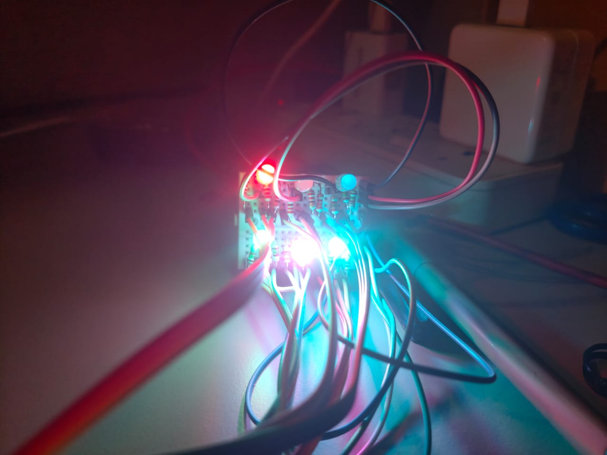
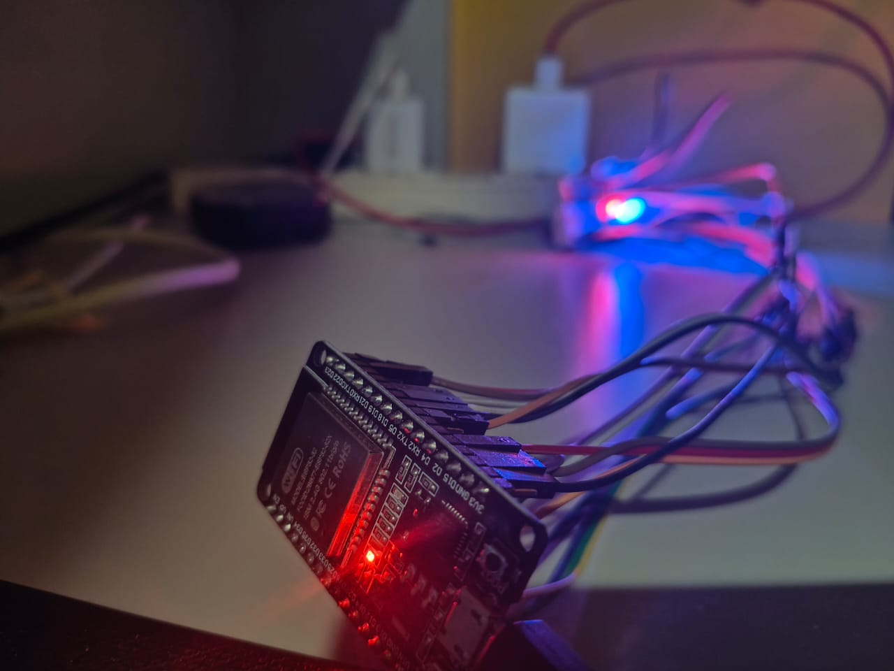
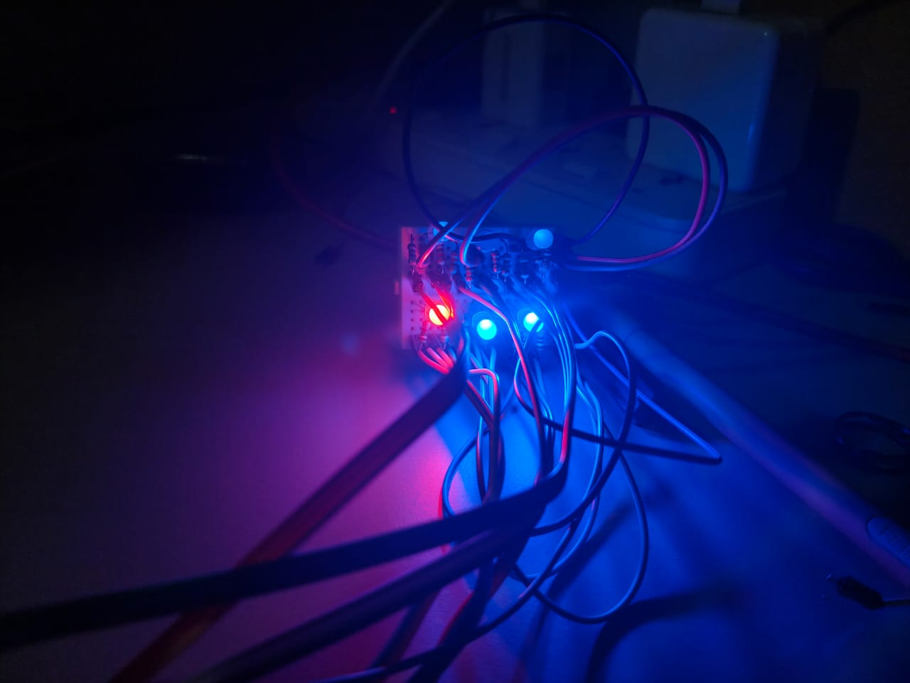

# 🎮✨ Arduino + ESP32 Interactive LED Projects  

Welcome to this collection of **fun & interactive projects** built using **Arduino & ESP32**.  
These projects explore **LED patterns, games, and gesture controls** 🔥  

---

## 📌 Projects Overview  

### 1️⃣ Dynamic LED Patterns  
- LEDs light up in creative, continuously updated patterns 🌈  
- Frequency & sequence of patterns change dynamically  
- Perfect for learning **basic Arduino LED control**  

🖼️ Demo Photo:  
  

---

### 2️⃣ ESP32 LED Reaction Game  
- A **2-player reaction game** where players compete to press first ⚡  
- Controlled via **ESP32 Web Server** (WiFi AP mode)  
- Displays **live scores** with reset option  
- Fun way to explore **ESP32 + Web + IoT**  

🖼️ Demo Photos:  
  
  

---

### 3️⃣ Gesture Controlled LED Game  
- Play the reaction game **without touching buttons** 🙌  
- Uses **hand gesture recognition (MediaPipe + Python)**  
- Gestures trigger **HTTP requests** to ESP32 server to control LEDs  
- Great intro to **Computer Vision + IoT integration**  

🖼️ Circuit Diagram:  
  

---

## 🎥 Demo Videos  

- 🔹 **LED Pattern Demo**  
  [![LED Pattern Video]](led_pattern/test_video.mp4)  

- 🔹 **LED Gesture Game Demo**  
  [![Reaction Game Video]](led_gesture_controlled/demo_video.mp4)

---

## 🛠️ Tech Stack  

- **ESP32** → Web server, LED game  
- **Python + MediaPipe** → Gesture recognition  
- **Electronics** → LEDs, resistors, push buttons  

---

## 🌟 Future Improvements

- Add multicolor LED patterns 🎆
- Support more gestures (rock-paper-scissors style) ✊✋✌️
- Port game to mobile app interface 📱

---

## 🤝 Contributing

- Pull requests are welcome!
- If you have new patterns, gestures, or game ideas, feel free to contribute 🚀

---

📜 License

This project is licensed under the MIT License.
